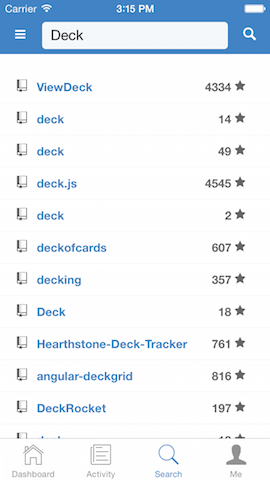

Deck
====

A tiny Github client, powered by [React Native](https://github.com/facebook/react-native). 

**Warning**: This project is still under development.

Development
-----------

You'll need to request a Personal access token [here](https://github.com/settings/tokens) and create a `Secrets.js` like this:

```javascript
module.exports = {
    token: 'token YOUR_TOKEN',
};
```

And put it under `App/Common`.


Screenshots
-----------




License
-------

MIT License

